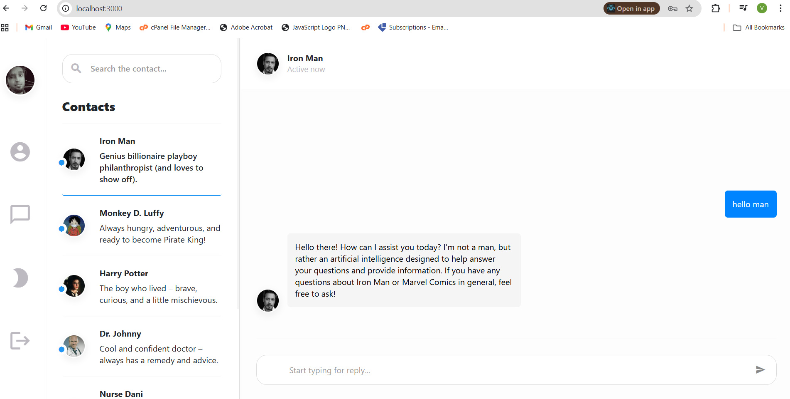

# Chat App

## 📸 Screenshots

### Chat UI



A **full-stack real-time chat application** built with **React (frontend)** and **Spring Boot (backend)**.  
It supports WebSocket-based communication, MongoDB for data persistence, and is designed with scalability in mind.  
The backend also integrates a **Mistral bot** for AI-powered responses.

---

## 🚀 Features

- 🔒 User authentication & security (Spring Security)
- 💬 Real-time messaging with WebSocket
- 📡 Backend built with **Spring Boot 3**
- 🗄️ MongoDB for message persistence
- 🤖 AI-powered bot (Mistral integration)
- 🌐 Frontend built with **React 19 + React Router**
- 📱 Modern responsive UI
- 🔄 REST + WebSocket hybrid communication

---

## 🛠️ Tech Stack

### Frontend
- React 19  
- React Router DOM 7  
- Axios for API requests  
- React Testing Library for tests  

### Backend
- Spring Boot 3  
- Spring WebSocket  
- Spring Security  
- Spring Data MongoDB  
- Spring WebFlux (for reactive HTTP client)  
- Lombok for boilerplate reduction  

### Database
- MongoDB  

---

## 📂 Project Structure

chat-app/
├── frontend/ # React frontend
│ ├── src/
│ │ ├── components/
│ │ ├── pages/
│ │ ├── App.jsx
│ │ └── index.js
│ └── package.json
│
└── backend/ # Spring Boot backend
├── src/main/java/com/chatapp/
│ ├── controller/
│ ├── model/
│ ├── service/
│ └── ChatAppApplication.java
├── src/main/resources/
│ └── application.properties
└── build.gradle.kts


---

## ⚡ Getting Started

### 1️⃣ Clone the repository
```bash
git clone https://github.com/littlenewprogrammer123/chat-app.git
cd chat-app


Setup the Backend (Spring Boot)

1.Navigate to backend/

cd backend

2.Start MongoDB (local or Atlas)

3.Configure application.properties (example below)

spring.data.mongodb.uri=mongodb://localhost:27017/chatapp
spring.security.user.name=admin
spring.security.user.password=admin
server.port=8080
mistral.api.key=your_mistral_api_key

4.Run the backend:

./gradlew bootRun


Setup the Frontend (React)

1.Navigate to frontend/

cd ../frontend
npm install


2.Create a .env file:

REACT_APP_API_URL=http://localhost:8080/api
REACT_APP_WS_URL=ws://localhost:8080/ws

3.Start the frontend:

npm start

4.Open http://localhost:3000

Running Tests
Frontend
npm test

Backend
./gradlew test

🧑‍💻 Author

Developed by littlenewprogrammer123


